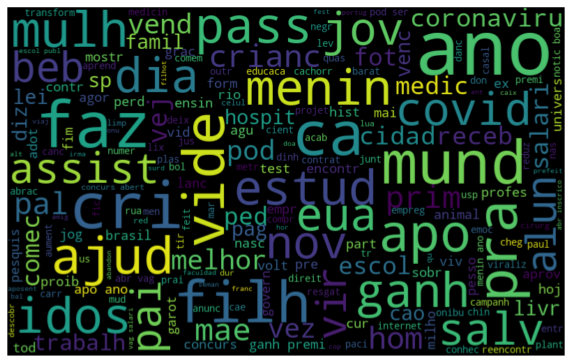
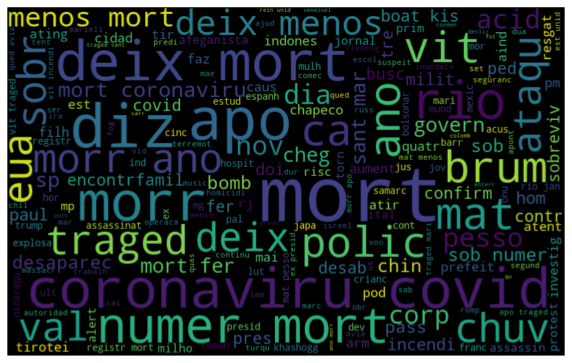

# Analysis of News Sentiments - (Análise dos Sentimentos das Notícias)

### **Objetivo**

Neste repositório você encontrará o meu primeiro trabalho desenvolvido com Machine Learning, uma das subáreas da inteligência artificial. 

Aqui apresento um algoritmo onde é possível aplicar os conceitos de NLP - Processamento da Linguagem Natural - com o objetivo de identificar qual o sentimento humano determinado texto transmite, no algoritmo especificamente iremos analisar os sentimentos das noticias de alguns dos maiores portais de notícia do Brasil, sendo os sentimentos positivos (1) ou negativos (0).

***Skills Aplicadas:***
- Natural Language Processing (NLP) - Processamento da Linguagem Natural
- Machine Learning - Aprendizado Supervisionado
- Web Scraping com Selenium e BS4
- Data Visualization com Python 
- Análise Exploratória de Dados
- Manipulação de Dados com Pandas

***Linguagens e Libraries usadas:***
- Python
- Pandas
- ScikitLearn (sklearn)
- Matplotlib
- WordCloud
- Seaborn
- String
- Unidecode
- BeautifulSoup
- Selenium
- sqlalchemy
- Joblib
- SQL

***Cursos usados para basear esse conhecimento:***
- [Python para Data Science: Funções, Pacotes e Pandas básico](https://cursos.alura.com.br/certificate/13699c08-cd99-40b4-853d-beacfd6b6883) Alura | Completion 7/01/20
- [Machine Learning: Introdução a classificação com SKLearn](https://cursos.alura.com.br/certificate/10c6fe9a-07a3-4f35-a117-b26dbda24c53) Alura | Completion 7/06/20
- [Linguagem Natural parte 1: Introdução a NLP com análise de sentimento](https://cursos.alura.com.br/certificate/cb9e0fca-382a-49b3-99c4-ecd6320550a4) Alura | Completion 7/09/20
- [Linguagem Natural parte 2: Continuando com a análise de sentimento](https://cursos.alura.com.br/certificate/2be10ee3-5ada-4a5b-86ee-7bce16e326c5) Alura | Completion 7/09/20

## **Processo**

O repositório contém arquivos que estão divididos e "Data Coletors" ou "Coletores de Dados" que tem a função de fazer um web scraping em portais de notícias que servirão como insumo para o treinamento do algoritmo, para isso é preciso dividir conceitualmente o que é uma notícia que transmita um sentimento positivo ou negativo. 

Para treinar o algoritmo com noticias boas foram utilizados os portais "Só Notícia Boa" e o portal G1 com as noticias da sessão "Olha Que Legal". 

Já para o treinamento das notícias negativas foi utilizado o portal Veja sessão "Tragédias" e portal Exame na sessão "Mortes".

A amostra coletada para o treinamento foi em torno de 6.500 noticias.

A partir das amostras temos então insumo suficiente para treinar o algoritmo. O detalhe do processo de treinamento do algoritmo pode ser consultado através do notebook **nlp_classifier.ipynb** portanto abordarei menos detalhadamente essa etapa.

Por fim, ao treinarmos o algoritmo é possível se obter uma espécie de padrão para as notícias consideradas humanamente negativa ou positiva. Sua acurácia ficou em torno de 90% com a base de treinamento, o que não garante sua replicação em novas amostras mas nos dá ideia de como o algoritmo está se comportando em um universo controlado.

## **Resultados - Wordcloud**

Abaixo está a WordCloud que mede a frequência em que uma palavra aperece em determinado contexto. Nete caso o contexto é o sentimento, dividos em negativo e positivo, para entedermos quais palavras mais influenciam o nosso algoritmo a tomar a decisão sobre qual é o sentimento do texto, logo ele irá considerar as palavras com mais peso de acordo com a sua relevância - as maiores palavras exibidas no wordcloud - pois foram essas palavras mais presente em determinado contexto no treinamento.

 

### ***Sentimento Positivo***

  

### ***Sentimento Negativo***

